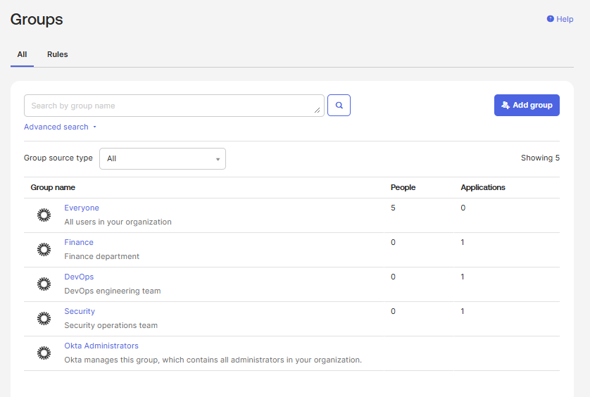
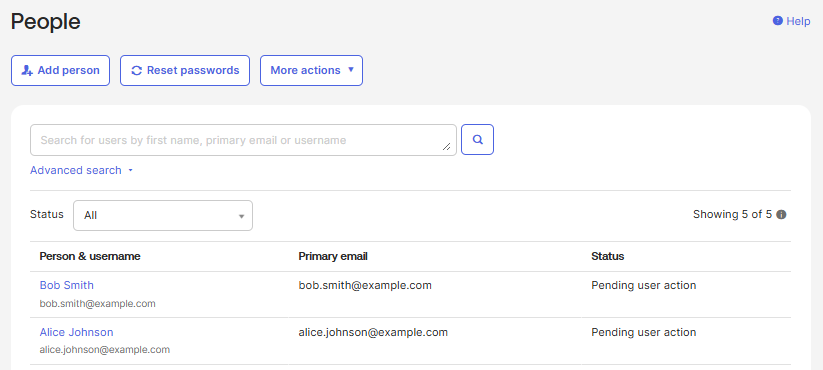
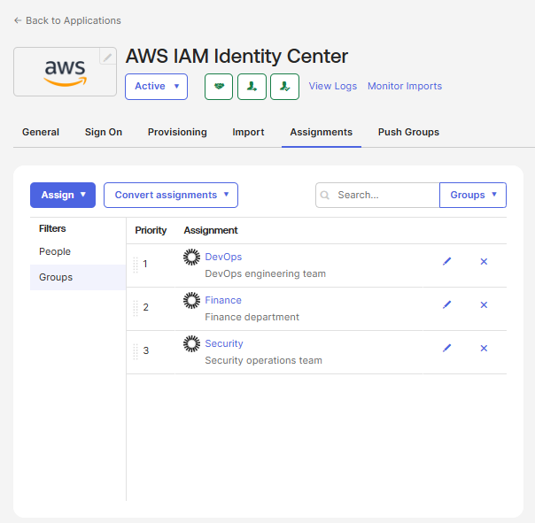

## Requirements

| Name | Version |
|------|---------|
|  [terraform](#requirement\_terraform) | ~> 1.14.0 |
|  [aws](#requirement\_aws) | ~> 6.28.0 |
|  [okta](#requirement\_okta) | ~> 6.5.0 |

## Providers

| Name | Version |
|------|---------|
|  [aws](#provider\_aws) | 6.28.0 |

## Modules

| Name | Source | Version |
|------|--------|---------|
|  [okta](#module\_okta) | ./modules/okta | n/a |

## Resources

| Name | Type |
|------|------|
| [aws_secretsmanager_secret_version.okta_private_key](https://registry.terraform.io/providers/hashicorp/aws/latest/docs/data-sources/secretsmanager_secret_version) | data source |

## Inputs

| Name | Description | Type | Default | Required |
|------|-------------|------|---------|:--------:|
|  [aws\_identity\_center\_app\_id](#input\_aws\_identity\_center\_app\_id) | Okta App ID for AWS IAM Identity Center | `string` | n/a | yes |
|  [okta\_base\_url](#input\_okta\_base\_url) | n/a | `string` | n/a | yes |
|  [okta\_client\_id](#input\_okta\_client\_id) | n/a | `string` | n/a | yes |
|  [okta\_groups](#input\_okta\_groups) | n/a | <pre>map(object({     description = string   }))</pre> | n/a | yes |
|  [okta\_org\_name](#input\_okta\_org\_name) | n/a | `string` | n/a | yes |
|  [okta\_private\_key\_id](#input\_okta\_private\_key\_id) | n/a | `string` | n/a | yes |
|  [okta\_scopes](#input\_okta\_scopes) | n/a | `list(string)` | n/a | yes |
|  [okta\_secret\_id](#input\_okta\_secret\_id) | n/a | `string` | n/a | yes |
|  [okta\_users](#input\_okta\_users) | n/a | <pre>map(object({     first_name = string     last_name  = string     email      = string     groups     = list(string)   }))</pre> | n/a | yes |
|  [region](#input\_region) | n/a | `string` | n/a | yes |

## Outputs

| Name | Description |
|------|-------------|
|  [users\_by\_group](#output\_users\_by\_group) | n/a |

## Visual Proof of Resource Creation
The following screenshots were taken directly from the Okta Admin Console after applying this Terraform configuration. They confirm successful provisioning of users, groups, and group-to-app assignments.
### Okta Groups Created
This screenshot shows the groups provisioned by Terraform, including:
- 
- Finance
- DevOps
- Security
- 

---
### Group Memberships Assigned
Each user defined in `var.okta_users` was automatically assigned to the groups listed in their `groups` array using the `okta_group_memberships` resource.

---
### AWS Identity Center App Assignment
Groups were assigned to the AWS IAM Identity Center Okta application using the `okta_app_group_assignments`.

---
